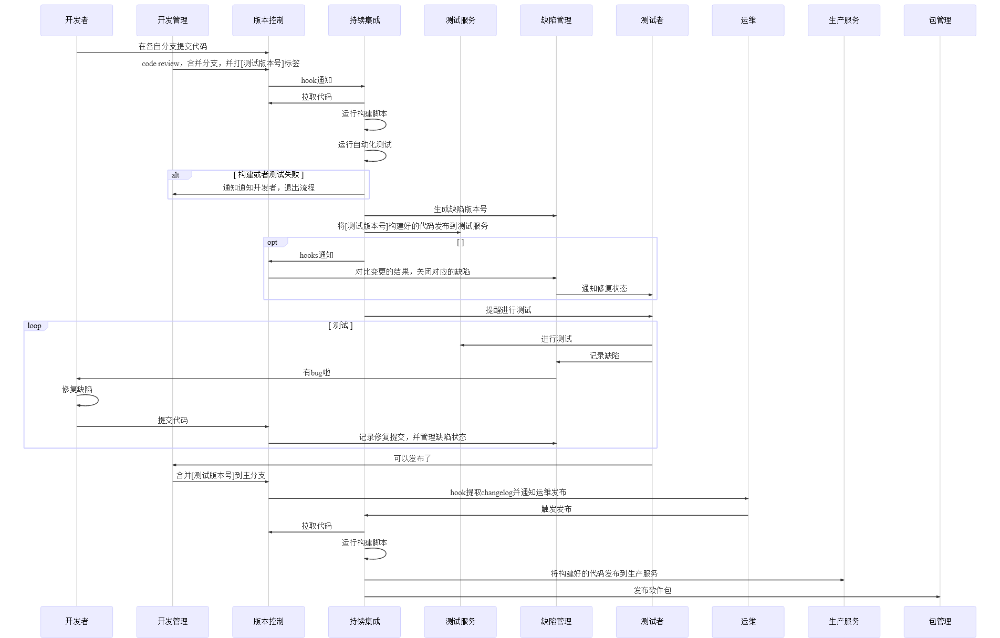

<!-- $size: 4:3 -->

项目开发以及发布的基本流程介绍
=====================

---

<!-- TOC depthTo:2 -->

- [1. 服务端](#1-服务端)
  - [1.1. 访问一个网络资源的基本过程](#11-访问一个网络资源的基本过程)
  - [1.2. 反向代理](#12-反向代理)
  - [1.3. 服务端应用](#13-服务端应用)
  - [1.4. 基于node的一些服务端框架](#14-基于node的一些服务端框架)
- [2. 编译、构建工具](#2-编译构建工具)
  - [2.1. 语言](#21-语言)
  - [2.2. 流程工具](#22-流程工具)
  - [2.3. 打包工具](#23-打包工具)
- [3. 版本控制工具](#3-版本控制工具)
  - [3.1. 客户端](#31-客户端)
  - [3.2. 服务端](#32-服务端)
  - [3.3. 基本操作](#33-基本操作)
- [4. 持续集成/交付/部署](#4-持续集成交付部署)
  - [4.1. 持续集成选择](#41-持续集成选择)
  - [4.2. lxc](#42-lxc)
- [5. 测试](#5-测试)
  - [5.1. 测试的种类](#51-测试的种类)
  - [5.2. 测试的主体](#52-测试的主体)
  - [5.3. 缺陷管理工具](#53-缺陷管理工具)
  - [5.4. 自动化测试工具](#54-自动化测试工具)
  - [5.5. UI测试工具](#55-ui测试工具)
- [6. 包管理](#6-包管理)
  - [6.1. 包管理器](#61-包管理器)
  - [6.2. 包管理registry](#62-包管理registry)
- [7. 文档](#7-文档)
  - [7.2. 自动化工具](#72-自动化工具)
- [8. 基本流程](#8-基本流程)
  - [一个简单的例子](#一个简单的例子)

<!-- /TOC -->

---

# 1. 服务端
## 1.1. 访问一个网络资源的基本过程
1. 客户端获得资源url
2. 经过dns服务器得到资源的ip
3. 浏览器发送请求报文：请求行，请求头，请求体到服务器
4. 服务器经过反向代理得到请求，转发给一个或多个均衡服务器的不同服务应用进行处理
5. 服务应用返回：响应行，响应头，响应体发送到反向代理服务器
6. 反向代理服务器响应相关的数据给客户端
7. 客户端软件渲染
---

## 1.2. 反向代理
- 请求转发，负载均衡
- nginx
- apache
## 1.3. 服务端应用
- java
- go
- node
- ...

---

## 1.4. 基于node的一些服务端框架
- [express](https://expressjs.com/) 可以说是元老级别的http服务，基于简单中间件的机制，现成的资源十分多
- [koa](https://koa.com/) 参考了express中间件机制，使用async或者generator对中间件进行语法封装，提升优化体验

---
# 2. 编译、构建工具

## 2.1. 语言
- es5、[esnext](https://babeljs.io/)
- jsx、[typescript](http://www.typescriptlang.org/)、[dart](https://www.dartlang.org/)、wxs
- [wasm](https://bellard.org/jslinux/vm.html?url=https://bellard.org/jslinux/win2k.cfg&mem=192&graphic=1&w=1024&h=768)、c++、c、[rust](https://www.rust-lang.org/)
- [less](http://lesscss.org/)、[scss](https://sass-lang.com/)、[stylus](http://stylus-lang.com/)、wxss
- html、vue、[pug（jade）](https://pugjs.org/api/getting-started.html)、wxml
- json、yaml、markdown、mmd

## 2.2. 流程工具
- gulp
- grunt

---

## 2.3. 打包工具
- [webpack](https://webpack.js.org/)
    适合团队项目，资源丰富，用户群体大
- [rollup](https://rollupjs.org/)
    更小的打包体积，针对node的模块处理
- [parcel](https://parceljs.org/)
    0配置/分散配置，自带dev服务，适合小型个人项目

---

# 3. 版本控制工具
## 3.1. 客户端
- [git](https://git-scm.com/) **主流**
- svn
- tfs

---

## 3.2. 服务端
- [github](https://github.com/)（gayhub）
- [gitlab](https://about.gitlab.com/) 团队项目最常见的git server之一
- [bitbucket](https://bitbucket.org/product) 著名Atlassian力作，一件套中的其中一件
- [gitee](https://gitee.com/) 码云
- [coding](https://coding.net/)

---

## 3.3. 基本操作
[Git 工作指南](https://github.com/lhmouse/git-workflow-zh/blob/master/workflow.md)

- clone	用于克隆项目，把项目拉取复制到本地
- commit 用于提交修改的代码
- push 用于推送提交的代码到远程
- pull 用于将远程代码更新到本地
- branch 用于建立分支，以区分不同开发者或不同开发环境
- merge 将分支合并到另外的分支
- tag 标记当前的修改记录，以区分不同版本
    
---

# 4. 持续集成/交付/部署
## 4.1. 持续集成选择
简单来说，ci/cd其实就是一个工作流整合工具，只不过它一般包括现成的基本环境配置工具和现成的基本流程处理
- [jenkins](https://jenkins.io/) 老牌ci工具，提供完备的web gui工具，支持docker，网上资源丰富，
- [travis ci](https://travis-ci.org/) 轻便简单，配置方便，对github支持简单绑定，常见于开源项目
- gitlab ci 团队项目最常见的ci之一，直接在gitlib里边集成，节省了部署ci服务的开销
- github actions [awesome-action](https://github.com/sdras/awesome-actions)
- coding ci 直接支持jenkinsFile来进行ci
- ...

---

## 4.2. lxc
通过linux container对服务应用以及其相关运行环境来实现打包部署
- [docker](https://www.docker.com/)

---

# 5. 测试
## 5.1. 测试的种类
  - 单元测试 就是将要测试的对象划分为一个一个的单元，对每个单元进行测试
  - 集成测试 对多个单元进行联合测试
  - 功能测试 对每一个功能进行测试
  - 冒烟测试 对主要功能进行测试
  - 回归测试 当程序代码出现更新迭代时候，对之前的功能进行测试
  - 性能/压力测试 对代码进行大样本测试，检查是否占用设备大量资源

---

## 5.2. 测试的主体
  - 人工/人肉测试
  - 自动化测试

## 5.3. 缺陷管理工具
- github issus
- gitlab issus
- [jira](https://www.atlassian.com/software/jira) 团队项目最常用的issus工具，工具很多，也提供多样的web api，可以为其他流程工具或者ide提供
- [tapd](https://www.tapd.cn/)

---

## 5.4. 自动化测试工具
### 测试框架
- [jest](https://jestjs.io/) 一个专注开发体验入门简单的测试框架
- [mocha](https://mochajs.org/) 最流行的JavaScript测试框架之一，在浏览器和Node环境都可以使用

### 断言库
- [chai](https://www.chaijs.com/)
- [should.js](https://shouldjs.github.io/)

---

## 5.5. UI测试工具
- [pupperteer](https://pptr.dev/) 一个node库，提供基于devtools protocol来操作chrome/chromium，并提供无头模式，可以用于api测试，以及复杂的爬虫
- phamtonjs
- selenium

---

# 6. 包管理
## 6.1. 包管理器
- npm
- yarn
## 6.2. 包管理registry
- registry.npmjs.org
- registry.npm.taobao.org
- [verdaccio](https://verdaccio.org/) 

---

# 7. 文档
- changelog.md
- api文档
## 7.2. 自动化工具
- [swagger](https://swagger.io/)
- [typedoc](https://typedoc.org/)
- jsdoc

---

# 8. 基本流程
---

## 一个简单的例子

[key-serializer](https://github.com/harvey-woo/key-serializer)